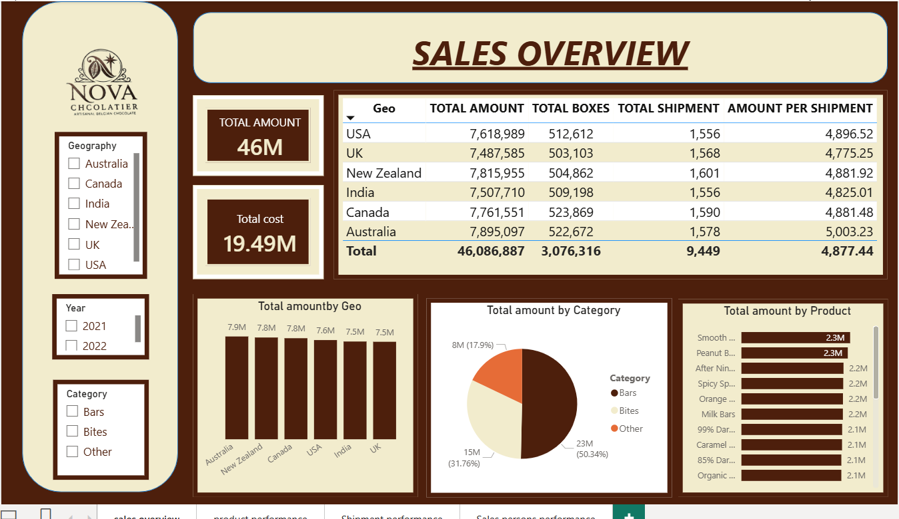
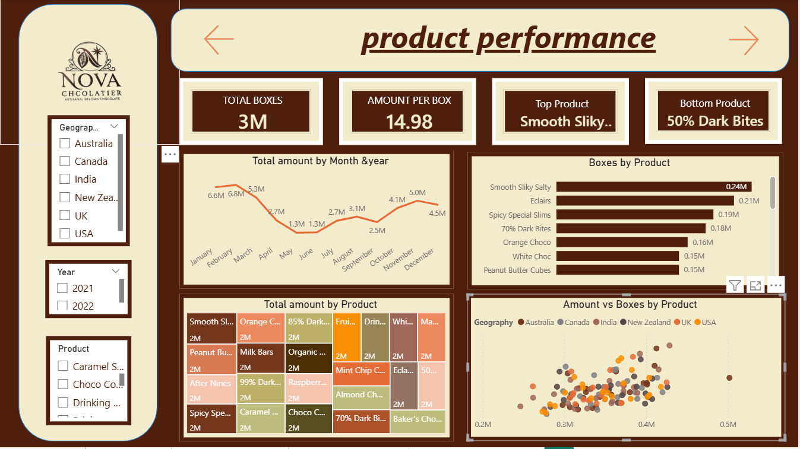
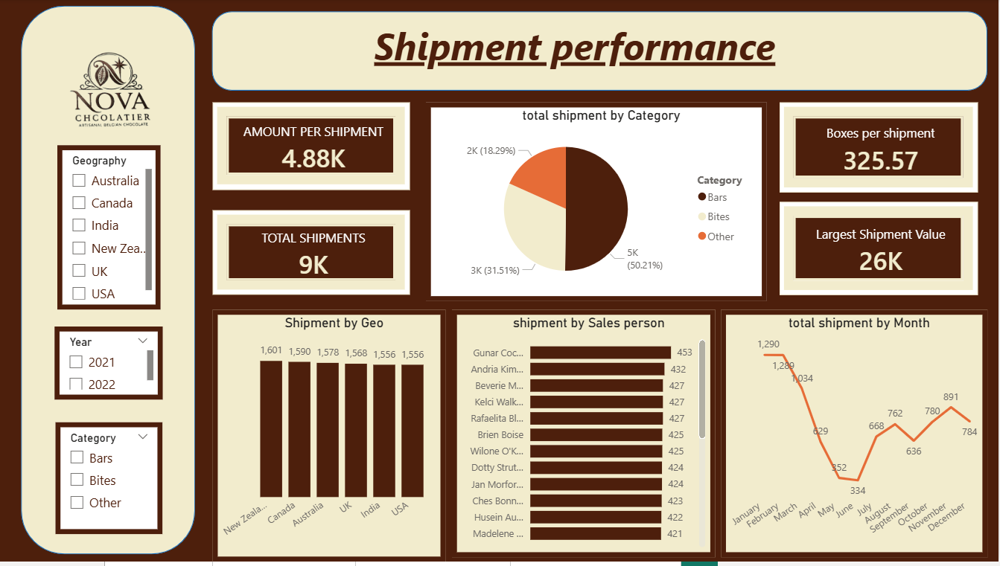
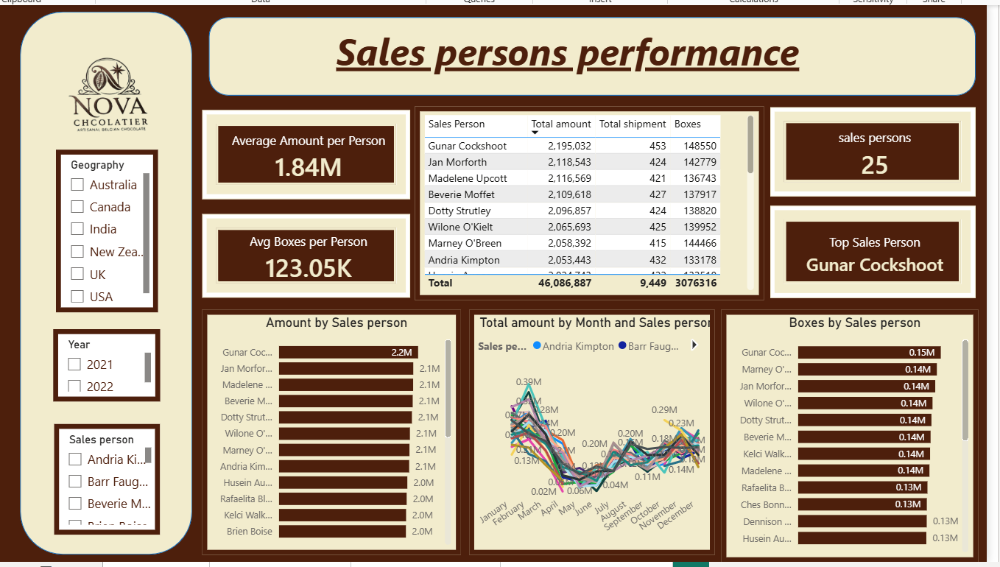

# 🍫  Chocolate — Sales Performance Dashboard

An interactive Power BI dashboard analyzing sales, shipment, and sales team performance for Nova Chocolatier, an artisanal Belgian chocolate brand, across 6 countries and 2 fiscal years.

## Overview

This dashboard tracks total sales, product performance, shipment logistics, and individual sales rep performance to help business stakeholders identify top-performing products, regions, and team members at a glance.

**Key metrics tracked:**
- Total sales amount: **46M**
- Total cost: **19.49M**
- Total shipments: **9K**
- Sales team size: **25 people**
- Coverage: Australia, Canada, India, New Zealand, UK, USA (2021–2022)

## 🖼️ Dashboard Preview

### Page 1 — Sales Overview

High-level view of total amount, cost, and shipments broken down by geography and product category.

### Page 2 — Product Performance

Tracks total boxes sold, amount per box, top/bottom performing products, and monthly sales trends.

### Page 3 — Shipment Performance

Shipment volume and value by geography, category, sales person, and month.

### Page 4 — Sales Persons Performance

Individual sales rep rankings by total amount, boxes sold, and monthly trends.

## 🔍 Filters (available on every page)
- **Geography:** Australia, Canada, India, New Zealand, UK, USA
- **Year:** 2021, 2022
- **Category:** Bars, Bites, Other
- **Sales Person** (Page 4 only)

## 🛠️ Tools
- Power BI Desktop
- Power Query
- DAX (calculated measures for amount per box, amount per shipment, and averages per sales person)

---

*Personal data analytics project.*
